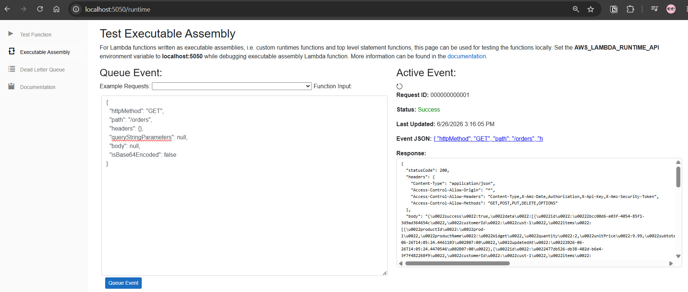

## Serverless Architecture and Function As A Service

### Serverless Architecture vs Function as a Service

**Serverless Architecture** is a broader design philosophy: you build systems entirely from managed cloud services, where you never provision or operate infrastructure yourself. The cloud provider handles servers, OS patching, scaling, and availability. You pay only for what you consume — idle resources cost nothing.

Serverless is not a single technology. It is a combination of managed services working together:

```
Client → API Gateway → Lambda (compute)
                         ↓
                      DynamoDB (database)       ← all serverless
                      SNS / SQS (messaging)
                      S3 (storage)
                      EventBridge (events)
```

**Function as a Service (FaaS)** is the *compute* layer of a serverless architecture. It is one specific piece — the part that runs your code. AWS Lambda is the FaaS offering on AWS. You deploy a function, define what triggers it, and the platform runs it on demand in a short-lived container.

The relationship is:
> Serverless Architecture **contains** FaaS. FaaS **is not** the whole of serverless.

**Key constraints of FaaS to design around:**
- **Stateless** — no in-memory state survives between invocations. Persist everything to DynamoDB, S3, or ElastiCache.
- **Cold starts** — the first invocation after idle spins up a new container (~200–500 ms for .NET). Subsequent calls reuse the warm container.
- **Short-lived** — AWS Lambda enforces a 15-minute maximum timeout. Long-running work (report generation, bulk imports) belongs in ECS Tasks or Step Functions.
- **Event-driven** — functions are triggered by something: an HTTP request, a queue message, a schedule, a file upload. There is no "always-on" process.

### AWS Services for Serverless Architecture

| Layer | AWS Service | Why it fits |
|---|---|---|
| **Compute** | Lambda | Runs your functions on demand; scales from zero to thousands of concurrent executions automatically |
| **HTTP API** | API Gateway | Managed HTTP/REST/WebSocket endpoint; routes requests to Lambda without running a web server |
| **Async messaging** | SNS | Fan-out pub/sub; one event (e.g. `OrderCreated`) notifies multiple downstream Lambdas in parallel |
| **Queue / buffering** | SQS | Decouples producers from consumers; Lambda polls the queue and processes messages in batches; retries on failure |
| **Event routing** | EventBridge | Rule-based routing of domain events between services; supports cron schedules (e.g. expire abandoned carts nightly) |
| **Database** | DynamoDB | Fully managed NoSQL; scales with Lambda automatically; no connection pool to manage (critical for FaaS) |
| **File storage** | S3 | Object storage for uploads, exports, and static assets; triggers Lambda on `PutObject` events |
| **Orchestration** | Step Functions | Coordinates multi-step workflows (e.g. order → payment → fulfillment → notification) with retries, timeouts, and branching |
| **Auth** | Cognito | Managed user pools and JWT issuance; API Gateway validates tokens before invoking Lambda |
| **Secrets** | Secrets Manager / SSM Parameter Store | Injects credentials and config into Lambda at runtime without hardcoding them |
| **Observability** | CloudWatch + X-Ray | Centralized logs, metrics, and distributed tracing across all Lambda invocations |

### How to organize your code

**One repository per bounded context.** A bounded context is a self-contained business domain with its own language, data model, and team ownership. Splitting by bounded context keeps each repo focused and independently deployable.

In an e-commerce platform:

```
order-service/          ← order lifecycle, line items, status
catalog-service/        ← product listings, inventory levels, pricing
customer-service/       ← accounts, addresses, loyalty points
payment-service/        ← charge, refund, payment method management
notification-service/   ← email, SMS, push notifications
```

**Within a repo, one function per use case.** Each AWS Lambda function corresponds to one business operation. In this repo each feature folder under `Features/` maps to a separately deployable Lambda:

```
Features/
  CreateOrder/       → CreateOrderFunction  (POST /orders)
  AddOrderItem/      → AddOrderItemFunction (POST /orders/{id}/items)
  CancelOrder/       → CancelOrderFunction  (DELETE /orders/{id})
  GetOrder/          → GetOrderFunction     (GET /orders/{id})
  UpdateOrderStatus/ → UpdateOrderStatusFunction
```

**Shared infrastructure lives at the repo level.** DynamoDB tables, SNS topics, SQS queues, and IAM roles are declared once in the SAM template (`deploy/aws/template.yaml`) and shared across all functions in the bounded context. Cross-context communication happens exclusively through events (SNS/EventBridge), never direct DB access.


## Local Development

### Start DynamoDB Local

```powershell
podman compose up -d
```

This launches DynamoDB container a long with creating GIS and seeding sample data.

### Lambda Test Tool

```powershell
dotnet tool install -g Amazon.Lambda.TestTool-8.0

dotnet lambda-test-tool-8.0 --port 5050
```

Leave this terminal open. The tool's UI is available at `http://localhost:5050`.

### Run

Each profile sets `LAMBDA_HANDLER` and all required environment variables automatically via `Properties/launchSettings.json`.  

Run the project with corresponding profile (function). The process starts and connects to the test tool.  

### Send a test event

1. Go to `http://localhost:5050`
2. Click the **Executable Assembly** link at the top of the page
3. Paste an API Gateway event into the **Function Input** box and click **Queue Event**

Example event for `CreateOrder`:

```json
{
  "httpMethod": "POST",
  "path": "/orders",
  "headers": { "Content-Type": "application/json" },
  "body": "{\"customerId\":\"cust-1\",\"items\":[{\"productId\":\"prod-1\",\"productName\":\"Wireless Mouse\",\"quantity\":2,\"unitPrice\":29.99}]}",
  "isBase64Encoded": false
}
```

More events are from orders.request.event.md



## Local Deployment

### One-time setup

Install the required tools:

```powershell
# AWS SAM CLI
winget install Amazon.SAM-CLI

# docker-compose (needed by podman compose)
winget install Docker.DockerCompose
```

Add SAM CLI to your PowerShell profile so it's always in PATH:

```powershell
# Append to $PROFILE (run once)
Add-Content $PROFILE "`n`$env:PATH += `";C:\Program Files\Amazon\AWSSAMCLI\bin`""
```

Verify your Podman machine is configured. The machine name and SSH port are visible via:

```powershell
podman machine list
podman machine inspect <machine-name>  # note the SSH Port value
```

---

### Starting a dev session

Run these steps in order each time you open a fresh terminal.

#### Step 1 — Start DynamoDB Local

```powershell
podman compose up -d
```

This starts DynamoDB Local on port 8000 and creates the `Orders-local` table with the `CustomerIdIndex` GSI.

#### Step 2 — Build

```powershell
sam build --template-file deploy/aws/template.yaml --base-dir .

podman build -t order-api-local:latest -f deploy/local/Dockerfile.lambda .aws-sam/build/CreateOrderFunction
```

#### Step 3 — Open SSH tunnel (keep this terminal open)

SAM uses the Docker SDK which requires a TCP socket. This tunnel bridges Windows TCP → Podman's Unix socket inside WSL.

```powershell
# Get your machine's SSH port (usually 58765, but verify with: podman machine inspect <name>)
$key = "$env:USERPROFILE\.local\share\containers\podman\machine\machine"
ssh -N -L 2375:/run/podman/podman.sock -p 58765 -i $key -o StrictHostKeyChecking=no root@127.0.0.1
```

#### Step 4 — Start SAM (new terminal)

```powershell
$env:DOCKER_HOST = "tcp://127.0.0.1:2375"
sam local start-api `
  --template-file deploy/local/template-local.yaml `
  --docker-network openmind-local `
  --skip-pull-image
```

Or 
```powershell
.\deploy\local\start.ps1
```
for better logs formatter.  

The API is available at `http://localhost:3000`.

> **First request per endpoint is slow (~30 s)** while SAM builds the Lambda runtime wrapper image. Every request after that is fast.

---

### After changing code

```powershell
sam build --template-file deploy/aws/template.yaml --base-dir .
podman build -t order-api-local:latest -f deploy/local/Dockerfile.lambda .aws-sam/build/CreateOrderFunction
```

or  
```powershell
.\deploy\local\build.ps1
```

Then **Ctrl+C** SAM and re-run the `sam local start-api` command from Step 4.

### Inspect DynamoDB

Use [NoSQL Workbench](https://docs.aws.amazon.com/amazondynamodb/latest/developerguide/workbench.html) to browse data locally.

Add a connection: **Operation Builder → Add Connection → DynamoDB Local → hostname `localhost`, port `8000`**.


## References
https://github.com/serverless/examples/tree/master/aws-dotnet-rest-api-with-dynamodb
